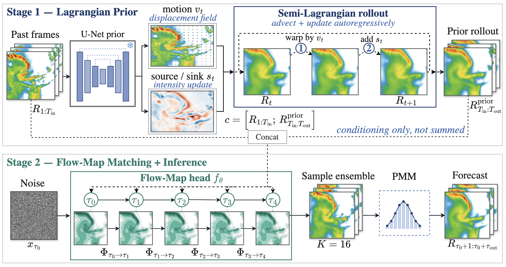

<div align="center">

# PG-FMM: Physics-Guided Flow-Map Matching for Precipitation Nowcasting

**ACCV 2026**

[Project page](https://neurogica.github.io/PG-FMM) · [Paper](web/assets/paper.pdf)

</div>

PG-FMM decouples the two things a precipitation nowcast has to get right — **where** the storm goes and **what** its fine structure looks like — into two stages:

1. **Stage 1 — Lagrangian advection prior (physics, frozen).** A U-Net predicts a per-step motion field `v_t` and a source/sink term `s_t`; a semi-Lagrangian rollout `R_{t+1} = warp(R_t, v_t) + s_t` produces a physically-consistent forecast that carries the predictable motion skill.
2. **Stage 2 — Flow-Map Matching head (generative).** A few-step (NFE=4) flow-map generator maps noise → forecast, **conditioned** on the concatenation of the past frames and the prior rollout (conditioning only, *not* summed). A `K=16` ensemble is combined with the Probability-Matched Mean (PMM).

The result is sharp, calibrated, and physically on-track: it improves over the strongest published baseline (AlphaPre) on **18 of 24** metrics across four radar benchmarks, with the largest margins on the heavy-rain thresholds where mean-seeking models blur out.

<div align="center">

</div>

## Repository layout

```
PG-FMM/
├── ml/          # method code (installable `pgfmm` package) + train / eval + configs
│   ├── pgfmm/           bridge/ (flow-map matching), source/ (Lagrangian prior),
│   │                    data/, metrics/, losses.py
│   ├── configs/         v22 + Lagrangian-prior configs for sevir/meteo/cikm/shanghai
│   ├── train.py         training entrypoint
│   ├── eval.py          evaluation entrypoint (AlphaPre-protocol metrics)
│   └── scripts/         cache builders (frozen prior rollout, baselines)
├── web/         # project page (static site) + figures
├── data/        # dataset download / layout instructions (no data committed)
├── pyproject.toml   # packaging + ruff
└── LICENSE          # BSD-3-Clause
```

See [`ml/README.md`](ml/README.md) to train/evaluate and [`data/README.md`](data/README.md) to obtain the datasets.

## Results (Table 1, headline)

| Dataset | Metric | AlphaPre | **PG-FMM (ours)** |
|---|---|---|---|
| SEVIR | CSI-M ↑ | 0.3259 | **0.3614** |
| SEVIR | CSI-219 ↑ (heaviest) | 0.0545 | **0.0925** |
| MeteoNet | CSI-M ↑ | 0.3824 | **0.4239** |
| Shanghai | CSI-M ↑ | 0.4178 | **0.4181** |
| CIKM | CSI-35 ↑ (heavy) | 0.2068 | **0.2218** |

Evaluation uses `K=16` ensemble + PMM at `NFE=4` under the AlphaPre protocol.

## Citation

```bibtex
@inproceedings{pgfmm2026,
  title     = {Physics-Guided Flow-Map Matching for Precipitation Nowcasting},
  author    = {The PG-FMM Authors},
  booktitle = {Asian Conference on Computer Vision (ACCV)},
  year      = {2026}
}
```

Released under the [BSD-3-Clause](LICENSE) license.
