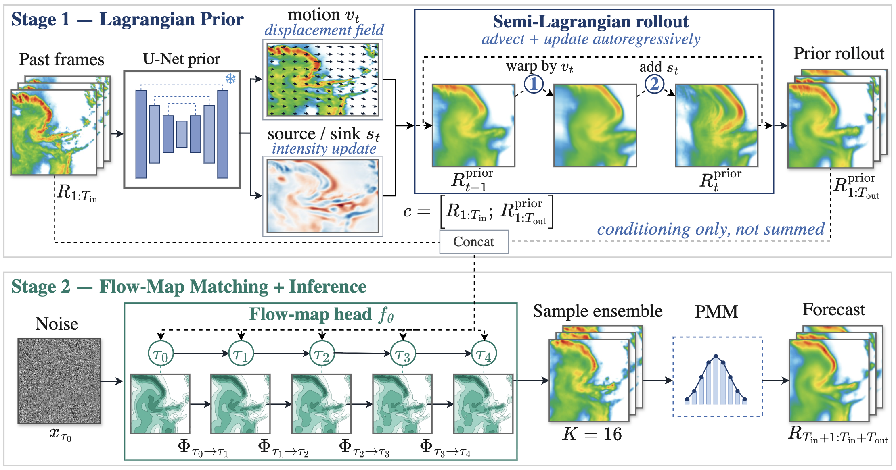

# PG-FMM

### Physics-Guided Flow-Map Matching for Precipitation Nowcasting

[](https://accv2026.org/)
[](https://neurogica.github.io/PG-FMM/)
[](https://www.python.org/)
[](https://docs.astral.sh/uv/)
[](https://github.com/Neurogica/PG-FMM/actions/workflows/ci.yml)
[](LICENSE)

**Decouple where the storm goes from what it looks like.** A frozen Lagrangian advection prior carries the predictable motion, and a few-step flow-map generator renders the stochastic detail on top, conditioned on the prior rather than summed onto it, so the generator replaces blurred structure instead of inheriting it.

<p align="center">
  
</p>

<p align="center">
  <a href="https://neurogica.github.io/PG-FMM/">Project page</a> ·
  <a href="web/assets/paper.pdf">Paper (PDF, with supplementary)</a> ·
  <a href="#results">Results</a> ·
  <a href="#getting-started">Getting started</a> ·
  <a href="#citation">Citation</a>
</p>

<details>
<summary><strong>Abstract — click to expand</strong></summary>

Precipitation nowcasting, generating future radar fields from past observations, is critical for flood warning and disaster response. It is also a demanding benchmark for spatiotemporal generative modeling, with chaotic dynamics, heavy-tailed intensities, and rare high-intensity structures that matter most. Deterministic models minimize a pixel loss and are driven toward the conditional mean, which blurs exactly those structures, while generative models that add a stochastic residual on top of a deterministic backbone inherit the same blur. We propose Physics-Guided Flow-Map Matching (PG-FMM), a conditional flow-map model that decouples predictable advection from uncertain small-scale detail. A frozen Lagrangian advection prior transports the radar field and supplies an explicit motion forecast, and a flow-map generative head, conditioned on the past frames and the prior rollout rather than summed onto it, produces sharp stochastic detail in four sampling steps. The prior serves only as guidance, so the head replaces blurred structure instead of inheriting it. Extensive experiments on four radar benchmarks show that PG-FMM outperforms state-of-the-art methods on 18 of 24 metrics, with the largest gains at heavy-rain thresholds, where the critical success index improves by up to 58.9%.

</details>

## How it works

1. **Stage 1: Lagrangian advection prior (physics, frozen).** A U-Net predicts a per-step motion field `v_t` and a source/sink term `s_t`. A semi-Lagrangian rollout `R_(t+1) = warp(R_t, v_t) + s_t` is a discretization of the advection equation in which only the coefficient fields are learned; the rollout operator itself has no parameters. The prior is trained once with supervised regression and then frozen.
2. **Stage 2: Flow-Map Matching head (generative).** A two-time flow-map generator maps noise to the future sequence, conditioned on the concatenation of the past frames and the prior rollout. Because the prior enters as conditioning and not as an additive residual, its conditional-mean blur is never inherited. Valid flow maps compose, so one network serves any step budget; we sample in four network evaluations.
3. **Inference.** Draw a 16-member ensemble at NFE = 4 and combine it with the probability-matched mean (PMM), which keeps the sharp peaks that a plain mean cancels. A single sample already exceeds the strongest published baseline on SEVIR CSI-M (0.3394 vs. 0.3259).

Training and evaluation run on one GPU. The Lagrangian prior's rollouts are cached, so Stage 2 trains on fixed conditioning.

## Results

Comparison under the AlphaPre evaluation protocol (shared evaluator, thresholds and test splits) on **SEVIR, MeteoNet, Shanghai and CIKM**; ours uses a 16-member probability-matched mean at NFE = 4. PG-FMM improves over the strongest published baseline on **18 of 24** metrics, with the largest margins at the heaviest thresholds.

| Dataset | Metric | AlphaPre | PG-FMM (ours) | Ours best on |
| :-- | :-- | --: | --: | :-: |
| SEVIR | CSI-M ↑ | 0.3259 | **0.3614** | 6 / 6 |
| SEVIR | CSI-219 ↑ (heaviest) | 0.0545 | **0.0925** |  |
| MeteoNet | CSI-M ↑ | 0.3824 | **0.4239** | 6 / 6 |
| MeteoNet | CSI-32 ↑ (heaviest) | 0.2002 | **0.2293** |  |
| Shanghai | CSI-M ↑ | 0.4178 | **0.4181** | 4 / 6 |
| Shanghai | CSI-40 ↑ (heaviest) | 0.2615 | **0.2636** |  |
| CIKM | CSI-M ↑ | **0.3194** | 0.3149 | 2 / 6 |
| CIKM | CSI-40 ↑ (heaviest) | 0.1416 | **0.1540** |  |

<details>
<summary><strong>Full comparison — Table 1 of the paper, all ten baselines</strong></summary>

Bold and underline mark the best and second-best entries per column. ND / D = without / with an explicit dynamics module. Baseline numbers are transcribed from the AlphaPre benchmark (Lin et al., CVPR 2025). The two highest thresholds of each dataset are its heavy-rain levels.

**SEVIR**

| Model | Type | CSI-M ↑ | CSI-181 ↑ | CSI-219 ↑ | HSS ↑ | SSIM ↑ | MSE ↓ |
| :-- | :-: | --: | --: | --: | --: | --: | --: |
| ConvGRU | ND | 0.2903 | 0.0879 | 0.0350 | 0.3619 | 0.6100 | 368.34 |
| MAU | ND | 0.3076 | 0.1071 | 0.0516 | 0.3863 | 0.6505 | 355.48 |
| SimVP | ND | 0.3108 | 0.1106 | 0.0517 | 0.3924 | 0.6508 | 383.56 |
| FourCastNet | ND | 0.2686 | 0.0717 | 0.0339 | 0.3355 | 0.5976 | 410.27 |
| Earthformer | ND | 0.2892 | 0.0844 | 0.0245 | 0.3665 | 0.6633 | 360.11 |
| PhyDNet | D | 0.3017 | 0.1040 | 0.0278 | 0.3812 | 0.6532 | 357.63 |
| Earthfarseer | D | 0.3004 | 0.0992 | 0.0413 | 0.3829 | 0.6327 | 388.91 |
| NowcastNet | D | 0.2791 | 0.0770 | 0.0351 | 0.3512 | 0.6839 | 412.94 |
| DiffCast | D | 0.3050 | 0.1300 | <ins>0.0582</ins> | 0.3996 | 0.6482 | 559.59 |
| AlphaPre | D | <ins>0.3259</ins> | <ins>0.1332</ins> | 0.0545 | <ins>0.4110</ins> | <ins>0.6884</ins> | <ins>345.18</ins> |
| PG-FMM (ours) | D | **0.3614** | **0.1859** | **0.0925** | **0.4593** | **0.7291** | **315.67** |

**MeteoNet**

| Model | Type | CSI-M ↑ | CSI-24 ↑ | CSI-32 ↑ | HSS ↑ | SSIM ↑ | MSE ↓ |
| :-- | :-: | --: | --: | --: | --: | --: | --: |
| ConvGRU | ND | 0.3401 | 0.2990 | 0.1431 | 0.4667 | 0.7833 | 12.85 |
| MAU | ND | 0.3233 | 0.2839 | 0.0997 | 0.4452 | 0.7897 | 12.92 |
| SimVP | ND | 0.3351 | 0.3002 | 0.1130 | 0.4573 | 0.7804 | 13.45 |
| FourCastNet | ND | 0.3027 | 0.2533 | 0.1085 | 0.4216 | 0.6450 | 15.05 |
| Earthformer | ND | 0.3205 | 0.2884 | 0.1237 | 0.4491 | 0.7772 | 14.43 |
| PhyDNet | D | 0.3384 | 0.3194 | 0.1366 | 0.4673 | 0.7823 | 14.48 |
| Earthfarseer | D | 0.3404 | 0.3170 | 0.1372 | 0.4726 | 0.7542 | 14.10 |
| NowcastNet | D | 0.3427 | 0.3206 | 0.1598 | 0.4751 | 0.7879 | 15.64 |
| DiffCast | D | 0.3512 | 0.3340 | 0.1808 | 0.4846 | 0.7887 | 17.93 |
| AlphaPre | D | <ins>0.3824</ins> | <ins>0.3633</ins> | <ins>0.2002</ins> | <ins>0.5164</ins> | <ins>0.7968</ins> | <ins>12.74</ins> |
| PG-FMM (ours) | D | **0.4239** | **0.4066** | **0.2293** | **0.5583** | **0.8426** | **9.25** |

**Shanghai**

| Model | Type | CSI-M ↑ | CSI-35 ↑ | CSI-40 ↑ | HSS ↑ | SSIM ↑ | MSE ↓ |
| :-- | :-: | --: | --: | --: | --: | --: | --: |
| ConvGRU | ND | 0.3612 | 0.3163 | 0.2062 | 0.4899 | 0.7796 | 33.56 |
| MAU | ND | 0.3983 | 0.3621 | 0.2417 | 0.5346 | 0.7195 | 30.40 |
| SimVP | ND | 0.3850 | 0.3549 | 0.2382 | 0.5194 | 0.7795 | 34.40 |
| FourCastNet | ND | 0.3571 | 0.3108 | 0.2073 | 0.4868 | 0.5598 | 32.10 |
| Earthformer | ND | 0.3503 | 0.3178 | 0.1872 | 0.4844 | 0.7298 | 35.57 |
| PhyDNet | D | 0.3654 | 0.3236 | 0.2176 | 0.4957 | 0.7751 | 36.41 |
| Earthfarseer | D | 0.3926 | 0.3608 | 0.2343 | 0.5330 | 0.5405 | 32.68 |
| NowcastNet | D | 0.3953 | 0.3608 | 0.2450 | 0.5334 | 0.7902 | 33.56 |
| DiffCast | D | 0.4089 | 0.3740 | 0.2606 | 0.5476 | 0.7879 | 36.35 |
| AlphaPre | D | <ins>0.4178</ins> | **0.3854** | <ins>0.2615</ins> | **0.5534** | <ins>0.7951</ins> | <ins>28.02</ins> |
| PG-FMM (ours) | D | **0.4181** | <ins>0.3819</ins> | **0.2636** | <ins>0.5520</ins> | **0.7962** | **26.05** |

**CIKM**

| Model | Type | CSI-M ↑ | CSI-35 ↑ | CSI-40 ↑ | HSS ↑ | SSIM ↑ | MSE ↓ |
| :-- | :-: | --: | --: | --: | --: | --: | --: |
| ConvGRU | ND | 0.3091 | 0.2009 | 0.1259 | 0.4006 | 0.6507 | 37.13 |
| MAU | ND | 0.3039 | 0.2054 | 0.1241 | 0.3928 | 0.6325 | 40.74 |
| SimVP | ND | 0.3052 | 0.2044 | 0.1321 | 0.3955 | 0.6538 | 38.06 |
| FourCastNet | ND | 0.2980 | 0.1849 | 0.1015 | 0.3801 | 0.4359 | <ins>36.14</ins> |
| Earthformer | ND | 0.3077 | 0.2039 | 0.1369 | 0.4001 | 0.6267 | 36.49 |
| PhyDNet | D | 0.3038 | 0.2052 | 0.1287 | 0.3931 | 0.6541 | 39.56 |
| Earthfarseer | D | 0.3000 | 0.2046 | 0.1259 | 0.3911 | 0.6373 | 39.87 |
| NowcastNet | D | 0.2991 | 0.1940 | 0.1188 | 0.3865 | **0.6713** | 40.96 |
| DiffCast | D | <ins>0.3159</ins> | 0.2009 | <ins>0.1457</ins> | 0.4085 | 0.6499 | 42.78 |
| AlphaPre | D | **0.3194** | <ins>0.2068</ins> | 0.1416 | **0.4137** | <ins>0.6568</ins> | **35.18** |
| PG-FMM (ours) | D | 0.3149 | **0.2218** | **0.1540** | <ins>0.4115</ins> | 0.6252 | 42.18 |

</details>

Further studies (ensemble-size sweep, sampling-step sweep, fusion ablation, structural metrics with frequency bias, matched-ensemble comparison against a generative baseline, calibration diagnostics) are in the supplementary material appended to the [paper PDF](web/assets/paper.pdf).

## Getting started

Requires Python 3.10–3.12 and [uv](https://docs.astral.sh/uv/getting-started/installation/). From the repository root:

```bash
uv sync --locked                 # core dependencies (PyTorch, diffusers, accelerate, ...)
uv run --locked pytest -q tests  # CPU smoke tests, no data or GPU needed (~30 s)
```

The tests cover the package imports, the Lagrangian prior's physical behaviour (identity and shift warping, rollout reproducibility) and a tiny PG-FMM runner that trains one step and samples end to end, with and without the physics prior.

## Usage

Point `PGFMM_DATA_ROOT` at the four radar benchmarks laid out as in [`data/README.md`](data/README.md) (no data is committed). PG-FMM is trained in two stages per dataset (`sevir`, `meteo`, `shanghai`, `cikm`):

```bash
export PGFMM_DATA_ROOT=/path/to/data

# Stage 1: Lagrangian advection prior
uv run python ml/train.py --config ml/configs/sevir/lagrangian_prior.yaml --note lagrangian_prior

# Stage 2: Flow-Map Matching head, conditioned on the frozen prior (motion.ckpt in the config)
uv run python ml/train.py --config ml/configs/sevir/pgfmm.yaml --note pgfmm
```

Evaluation reproduces the protocol of Table 1 (metrics reuse the AlphaPre benchmark evaluator; see [`ml/README.md`](ml/README.md) for the one-time setup):

```bash
uv run python ml/eval.py \
  --ckpt runs/sevir/pgfmm/checkpoints/last.pt --config ml/configs/sevir/pgfmm.yaml \
  --split test --ensemble 16 --ensemble_agg pmm --nfe 4 --use_ema --csv_out results/sevir.csv
```

Outputs go to `runs/<dataset>/<note>/` (override with `PGFMM_OUT`). Pretrained checkpoints for the four datasets will be hosted on Hugging Face and linked here once uploaded.

## Development

```bash
uv sync --locked --extra dev --extra eval
uv run --locked ruff check .
uv run --locked pytest -q tests
```

CI runs the lint and the smoke tests on Python 3.10, 3.11 and 3.12.

## Repository contents

```text
ml/pgfmm/       method code: model/ (flow-map head, U-Net, sampler), source/ (Lagrangian prior),
                data/ (SEVIR, MeteoNet, CIKM, Shanghai loaders), losses.py
ml/configs/     PG-FMM and Lagrangian-prior configs for the four datasets
ml/train.py     training entrypoint (both stages)
ml/eval.py      evaluation entrypoint (AlphaPre-protocol metrics)
ml/scripts/     cache builders (frozen prior rollouts, baseline predictions)
tests/          CPU smoke tests
data/           dataset layout and sources (no data committed)
web/            project page (GitHub Pages) and the paper PDF
uv.lock         resolved dependencies
```

Reproducing the paper's tables additionally requires the four benchmarks and the AlphaPre evaluator; neither is included here.

## Citation

```bibtex
@inproceedings{nagashima2026pgfmm,
  title     = {Physics-Guided Flow-Map Matching for Precipitation Nowcasting},
  author    = {Shunya Nagashima and Takumi Bannai and Makoto Misaizu and Keisuke Maeda and Takahiro Ogawa and Miki Haseyama},
  booktitle = {Proceedings of the Asian Conference on Computer Vision (ACCV)},
  year      = {2026}
}
```

[CITATION.cff](CITATION.cff) separately describes the software.

## License

[BSD-3-Clause](LICENSE). Third-party datasets, the AlphaPre evaluator and dependencies remain subject to their respective licenses.
